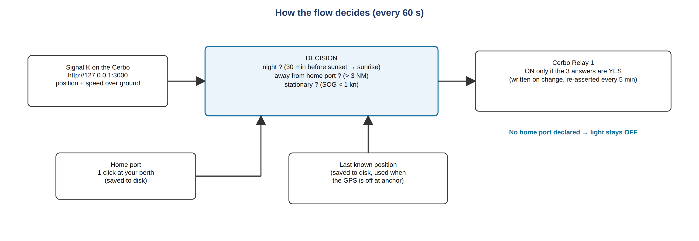
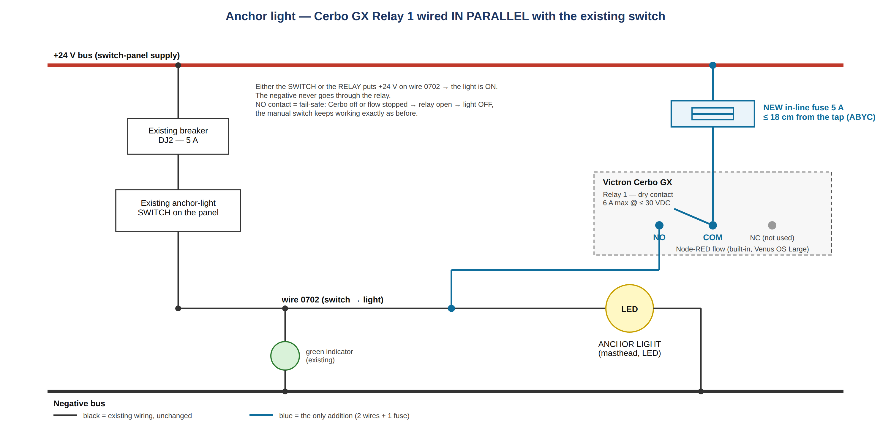

# Automatic Anchor Light with the Victron Cerbo GX — Complete DIY Guide (Amel) — v3.1

*Your anchor (mooring) light switches itself on at dusk and off at sunrise — only when the boat is really at anchor, never in your home port, never under way — while the original manual switch keeps working exactly as before. No extra hardware: the Cerbo GX does everything. Built and used on "Haku", Amel 50 (24 V). Any Amel owner with a Cerbo GX can reproduce it alone in an afternoon.*

Repository (flow file, diagrams, this guide in EN/FR): **https://github.com/SLPH77300/anchor-light-auto-cerbo-amel**

---

## 1. What it does

The Cerbo GX switches the anchor light through its built-in **Relay 1**, driven by a small **Node-RED** flow that runs on the Cerbo itself (no Raspberry Pi, no cloud, no PC once set up).

**The light is ON only when ALL THREE conditions are true:**

| Condition | Rule | Why |
|---|---|---|
| **Night** | from **30 min before sunset** until **sunrise**, computed on board from the GPS position (no internet) | COLREG rule 30: anchor light from sunset to sunrise — switching on a little early is on the safe side |
| **Away from home port** | more than **3 NM** (adjustable) from the home port you declared | no light needed at your own berth, and a boat left in the marina never lights up by itself |
| **Stationary** | speed over ground **below 1 kn** | the anchor light must never show while under way (you show your navigation lights instead) |

Everything else → light OFF. The flow checks every **60 s**, writes the relay **only when the state changes** and re-asserts it every 5 min.

**Safe by design**

- **No home port declared → the light stays OFF** (red status in Node-RED tells you what to do).
- **The manual switch keeps priority**: it is wired in parallel and works even if the Cerbo or Node-RED is off.
- **Fail-safe OFF**: the relay uses its NO contact — if the Cerbo reboots or the flow stops, the light is simply off.

---

## 2. Requirements

- A **Victron Cerbo GX** (or any GX device with a relay) running **Venus OS Large** — the image that contains Node-RED and Signal K, free.
- A **GPS the Cerbo already sees**: an NMEA 2000 GPS on the VE.Can port, or a Victron GPS. Position and speed are read through **Signal K** (built into Venus OS Large), so there is **nothing to configure in GPS nodes**. On Haku: Furuno GP330B on NMEA 2000.
- An existing **anchor light on a switched circuit** (all Amels have one) — an **LED** light is assumed (a few watts).
- Small parts: a bit of **1.5 mm² tinned marine cable**, an **in-line fuse holder + 5 A fuse**, ferrules, a crimper, a multimeter.

> The Cerbo relay is a potential-free contact rated **6 A max @ ≤ 30 VDC**. An LED anchor light draws far less, so it is switched directly, without an external relay. For an incandescent bulb, check the current (P / 24 V) — above ~4 A add a small power relay.

---

## 3. Wiring (the electrical part)

**Key point: the Cerbo relay is a DRY contact — it is just a switch, it does NOT output + or −.** You put it **in parallel with the existing anchor-light switch**, so that **either the switch OR the relay** sends +24 V (or +12 V) to the light.

### Cerbo Relay 1 terminals

| Relay terminal | Connect to |
|---|---|
| **COM** | **Permanent +24 V** taken from the switch-panel supply bus, **through a 5 A in-line fuse** |
| **NO** | The **wire that runs from the anchor-light switch to the light** (the switched output) |
| **NC** | Not used |

The light's **negative** stays exactly where it is — never through the relay.

### On Haku (Amel 50), for reference

- Anchor light circuit **0702**, breaker **DJ2 5 A**, folio 07 of the 24 VDC drawings ("Platine 24 VDC N°2 – Table à carte").
- Relay 1 **NO** → wire **0702** (switch output → light). Relay 1 **COM** → permanent **+24 V** on the switch-input bus, via the **5 A in-line fuse**.
- Cable **1.5 mm² tinned marine**, ferrules crimped.
- The panel's green indicator lamp is wired on the output side (0702 → negative), so **it lights whether the switch or the relay turns the light on** — nothing changes for the crew.

### Safety rules

- **The 5 A in-line fuse goes within ~18 cm (7") of the + tap** (ABYC E-11): the short piece of wire between the bus and the fuse is otherwise unprotected.
- Fuse holder **fixed** (cable-tied), not dangling; **weatherproof** holder if it lives in a locker.
- No conflict if switch and relay are both on at once — same +24 V on the same wire.
- **Fail-safe:** NO contact → Cerbo off or flow stopped → relay open → light OFF; the manual switch still works.

---

## 4. Cerbo / software setup (once)

### 4.1 Enable the tools on the Cerbo

1. **Venus OS Large**: *Settings → Firmware → Online updates → Image type: Large*, then update. (Node-RED and Signal K are included.)
2. **Enable Node-RED and Signal K**: *Settings → Venus OS Large features* (older firmware: *Settings → Services*) → **Node-RED: Enabled** and **Signal K: Enabled**.
3. **Relay 1 → Manual**: *Settings → Relay → Function (Relay 1) → Manual*. If it is left on "Alarm" or "Generator", external control is blocked.
4. **Check the GPS in Signal K**: open `http://venus.local:3000` (or `http://<Cerbo-IP>:3000`) → *Data Browser* → `navigation.position` and `navigation.speedOverGround` must show live values. If they don't, Signal K does not see your GPS yet (check the GPS in the Cerbo *Device list* first).

### 4.2 Import the flow

1. On a laptop/tablet on the boat network, open **`http://venus.local:1880`** (or `http://<Cerbo-IP>:1880`).
2. **Menu (☰) → Import → select a file** → `anchor-light-auto-cerbo_v3.1.json` from the repository → **Import**.
3. Click **Deploy**.
4. Double-click the node **"Cerbo Relay 1 (anchor light)"**: it should already show service **Venus device** and path **Venus relay 1 state** (`/Relay/0/State`, the "Relay 1" terminals). If the node shows a red status or empty fields (older palette version), re-select them, click *Done*, then **Deploy** again.

That is the only Victron node in the flow — position and speed come from Signal K automatically.

### 4.3 Declare your home port (1 click)

- **Easy:** while sitting at your home berth, click the inject button **"Set home port HERE"**. The node turns green and shows the coordinates. Done — it is saved on disk and survives reboots and firmware updates.
- **Manual:** double-click **"Set home port MANUALLY"**, edit the JSON payload `{"lat": 37.986, "lon": 13.704, "radius": 3}` with your own values, *Done*, *Deploy*, then click its button.
- Sailing to a new base for the season? Click "Set home port HERE" again at the new berth.

Until a home port is declared the decision node stays **red: "HOME PORT NOT SET"** and the light stays OFF.

### 4.4 Optional tuning (top of the "Decision" function node)

| Constant | Default | Meaning |
|---|---|---|
| `SUN` | `-0.833` | sun altitude taken as night. `-0.833` = official sunset/sunrise; `-6` = civil twilight (light comes on later) |
| `PRE_SUNSET_MIN` | `30` | switch on this many minutes before sunset |
| `SPEED_MAX_KN` | `1.0` | "stationary" threshold in knots |
| `DEFAULT_RADIUS_NM` | `3` | home-port radius when the declared port has none |
| `REASSERT_EVERY` | `5` | re-send the relay state every N polls (5 = every 5 min) |

### 4.5 What is stored where

- `/data/home/nodered/.node-red/anchorlight_homeport.json` — your home port (lat, lon, radius).
- `/data/home/nodered/.node-red/anchorlight_lastpos.json` — the last known position, rewritten only when the boat has moved more than ~90 m or every 10 min (limits flash wear).

Both live in the Node-RED user directory of Venus OS, which is writable by Node-RED and persists across reboots **and firmware updates**. At anchor the GPS is often switched off: the flow then keeps deciding from the **last known position**.

---

## 5. Testing, safety & troubleshooting

### Test in 2 minutes

1. Click **"TEST relay ON"** → the relay clicks and the light comes on (check the panel's green lamp). Click **"TEST relay OFF"** → off. If nothing happens: Relay 1 is not on *Manual*, or the relay node is not configured (§4.2 step 4).
2. Read the status text under the **Decision** node: it tells you everything — e.g. `light off - day | 4.2 NM from port | 0.0 kn` or `LIGHT ON - night | 5.1 NM from port | 0.3 kn`.
3. Any manual test or manual change from the Remote Console is **overridden within 5 min** by the automatic decision — that is intended. To force the light, use the physical switch.

### Status messages of the Decision node

| Status | Meaning / what to do |
|---|---|
| grey `no position known (check Signal K)` | Signal K disabled, or no GPS fix yet, or GPS not visible in Signal K (§4.1 step 4) |
| red `HOME PORT NOT SET` | click "Set home port HERE" at your berth (§4.3) |
| blue `light off - day …` / `… in port …` / `… 3.4 kn` | normal: one of the three conditions is false |
| green `LIGHT ON - night | 5.1 NM from port | 0.3 kn` | anchored at night, light on |
| `(last pos)` in the text | GPS off — deciding from the last saved position |

### Legal (COLREG rule 30)

A vessel at anchor must exhibit an all-round white light from sunset to sunrise. The **"stationary < 1 kn"** condition guarantees the light **never** comes on while under way. The **manual switch always overrides** — treat the automation as an aid, not a replacement, and check local rules. **Choose a home-port radius that does not cover anchorages where you actually stop**: inside the radius the light is considered "not needed" and stays off (use the switch there).

### Other symptoms

- **Light stays on in the marina** → your berth is outside the declared radius: click "Set home port HERE" at the berth, or increase `radius`.
- **Light never comes on at anchor** → check the status line: `in port` (anchorage inside the radius → reduce the radius or move the home port), `day`, or a speed above 1 kn (drifting on a swinging mooring in strong current: raise `SPEED_MAX_KN` to 1.5).
- **After a firmware update** → nothing to do: files and flow are in `/data`. If the relay node shows an error, re-select the service/path (§4.2 step 4).

---

## 6. The flow (Node-RED)

The complete flow is the file **`flow/anchor-light-auto-cerbo_v3.1.json`** (19 nodes). The four function nodes are also readable as plain JavaScript in `src/` and covered by unit tests (`node tools/test_flow.js`):

| Node | Role |
|---|---|
| `Poll Signal K every 60 s` → `GET Signal K vessels/self` | reads position and SOG from `http://127.0.0.1:3000/signalk/v1/api/vessels/self` |
| `Decision (night + away from port + stationary)` | the three conditions, sun altitude (SunCalc-style), great-circle distance; output 1 → relay, output 2 → last-position file |
| `Cerbo Relay 1 (anchor light)` | Victron node writing `com.victronenergy.system` `/Relay/0/State` (1 = ON) |
| `Set home port HERE` / `MANUALLY` → `Set home port` → `write home port` | declares and saves the home port |
| `At start-up` → `read …` → `Load home port` / `Load last position` | restores both files after a reboot |
| `TEST relay ON / OFF` | manual relay tests |

---

## 7. Changes since the version posted on the forum (v2, August 2026)

- **Position and speed come from Signal K** — no more Victron GPS nodes to configure (the 3 "GPS → à configurer" nodes are gone).
- **Home port declaration reworked**: one click at the berth or manual coordinates; **no home port = light OFF** (the v2/v3 fallback on Haku's own port is removed for a public release); the files are saved in the Node-RED user directory (`/data/home/nodered/.node-red/`), which is writable by the Node-RED user (the v2 path `/data/haku_*.json` could fail to write depending on permissions, losing the declared port at reboot).
- **Light on 30 min before sunset** (v2: at sunset), **polling every 60 s** (v2: 30 min), **default radius 3 NM** (v2: 2 NM).
- Relay state **re-asserted every 5 min** (self-corrects a manual toggle), **test injects** added, last-position writes throttled, English node names and status texts.

---

*Node names, comments and statuses are in English; the logic is universal — rename freely. Built and used on "Haku", Amel 50, 24 V, Cerbo GX + Venus OS Large. Use at your own risk; the manual switch and COLREG obligations always take precedence. MIT licence.*
