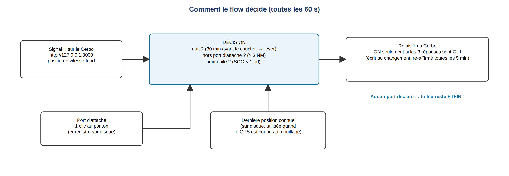
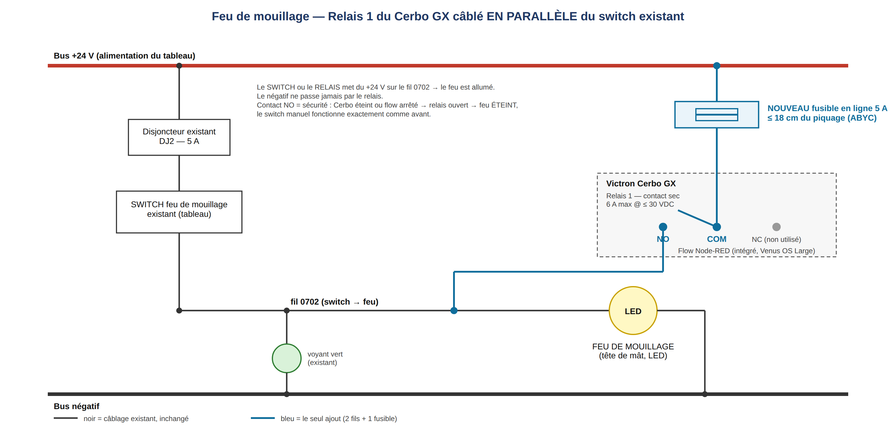

# Feu de mouillage automatique avec le Victron Cerbo GX — Guide complet DIY (Amel) — v3.1

*Votre feu de mouillage s'allume seul à la tombée de la nuit et s'éteint au lever du soleil — uniquement quand le bateau est vraiment au mouillage, jamais dans votre port d'attache, jamais en navigation — et le switch manuel d'origine continue de fonctionner exactement comme avant. Aucun matériel supplémentaire : le Cerbo GX fait tout. Réalisé et utilisé sur « Haku », Amel 50 (24 V). Tout propriétaire d'Amel équipé d'un Cerbo GX peut le reproduire seul en une après-midi.*

Dépôt (fichier du flow, schémas, ce guide en FR/EN) : **https://github.com/SLPH77300/anchor-light-auto-cerbo-amel**

---

## 1. Ce que ça fait

Le Cerbo GX commande le feu de mouillage par son **Relais 1** intégré, piloté par un petit flow **Node-RED** qui tourne sur le Cerbo lui-même (pas de Raspberry Pi, pas de cloud, pas de PC une fois installé).

**Le feu est allumé seulement si les TROIS conditions sont vraies :**

| Condition | Règle | Pourquoi |
|---|---|---|
| **Nuit** | de **30 min avant le coucher du soleil** jusqu'au **lever**, calculé à bord à partir de la position GPS (sans internet) | Règle 30 du RIPAM/COLREG : feu de mouillage du coucher au lever — allumer un peu tôt est du côté sûr |
| **Hors du port d'attache** | à plus de **3 NM** (réglable) du port d'attache que vous avez déclaré | pas de feu nécessaire à votre ponton, et un bateau laissé à la marina ne s'allume jamais tout seul |
| **Immobile** | vitesse fond **inférieure à 1 nœud** | le feu de mouillage ne doit jamais apparaître en route (on montre les feux de navigation) |

Sinon → feu éteint. Le flow vérifie toutes les **60 s**, écrit le relais **seulement au changement d'état** et le ré-affirme toutes les 5 min.

**Sûr par conception**

- **Aucun port d'attache déclaré → le feu reste ÉTEINT** (un statut rouge dans Node-RED dit quoi faire).
- **Le switch manuel garde la priorité** : il est câblé en parallèle et fonctionne même Cerbo ou Node-RED éteints.
- **Sécurité positive** : le relais utilise son contact NO — si le Cerbo redémarre ou si le flow s'arrête, le feu est simplement éteint.

---

## 2. Prérequis

- Un **Victron Cerbo GX** (ou tout appareil GX avec un relais) sous **Venus OS Large** — l'image qui contient Node-RED et Signal K, gratuite.
- Un **GPS déjà vu par le Cerbo** : GPS NMEA 2000 sur le port VE.Can, ou GPS Victron. Position et vitesse sont lues via **Signal K** (intégré à Venus OS Large) : **rien à configurer dans des nœuds GPS**. Sur Haku : Furuno GP330B en NMEA 2000.
- Un **feu de mouillage existant sur un circuit à interrupteur** (tous les Amel en ont un) — feu **LED** supposé (quelques watts).
- Petit matériel : un peu de **câble 1,5 mm² étamé marine**, un **porte-fusible en ligne + fusible 5 A**, des embouts, une pince à sertir, un multimètre.

> Le relais du Cerbo est un contact sec limité à **6 A max sous ≤ 30 VDC**. Un feu LED consomme bien moins : commutation directe, sans relais externe. Pour une ampoule à incandescence, vérifier le courant (P / 24 V) — au-delà de ~4 A, ajouter un petit relais de puissance.

---

## 3. Câblage (la partie électrique)

**Point clé : le relais du Cerbo est un contact SEC — c'est juste un interrupteur, il ne fournit NI + NI −.** On le place **en parallèle du switch existant du feu de mouillage**, pour que **le switch OU le relais** envoie le +24 V (ou +12 V) au feu.

### Bornes du Relais 1 du Cerbo

| Borne du relais | Raccorder à |
|---|---|
| **COM** | **+24 V permanent** pris sur le bus d'alimentation du tableau, **à travers un fusible en ligne 5 A** |
| **NO** | Le **fil qui va du switch du feu de mouillage au feu** (la sortie commutée) |
| **NC** | Non utilisé |

Le **négatif** du feu reste exactement où il est — jamais par le relais.

### Sur Haku (Amel 50), pour référence

- Circuit feu de mouillage **0702**, disjoncteur **DJ2 5 A**, folio 07 des plans 24 VDC (« Platine 24 VDC N°2 – Table à carte »).
- Relais 1 **NO** → fil **0702** (sortie switch → feu). Relais 1 **COM** → **+24 V** permanent sur le bus d'entrée des switches, via le **fusible 5 A en ligne**.
- Câble **1,5 mm² étamé marine**, embouts sertis.
- Le voyant vert du tableau est câblé côté sortie (0702 → négatif) : **il s'allume que le feu soit commandé par le switch ou par le relais** — rien ne change pour l'équipage.

### Règles de sécurité

- **Le fusible 5 A en ligne se place à moins de ~18 cm du piquage +** (ABYC E-11) : le bout de fil entre le bus et le fusible n'est sinon pas protégé.
- Porte-fusible **fixé** (collier), pas ballant ; modèle **étanche** s'il vit dans un coffre.
- Aucun conflit si switch et relais sont actifs en même temps — même +24 V sur le même fil.
- **Sécurité positive :** contact NO → Cerbo éteint ou flow arrêté → relais ouvert → feu ÉTEINT ; le switch manuel fonctionne toujours.

---

## 4. Réglage du Cerbo / logiciel (une fois)

### 4.1 Activer les outils sur le Cerbo

1. **Venus OS Large** : *Settings → Firmware → Online updates → Image type : Large*, puis mise à jour. (Node-RED et Signal K sont inclus.)
2. **Activer Node-RED et Signal K** : *Settings → Venus OS Large features* (anciens firmwares : *Settings → Services*) → **Node-RED : Enabled** et **Signal K : Enabled**.
3. **Relais 1 → Manuel** : *Settings → Relay → Function (Relay 1) → Manual*. S'il reste sur « Alarm » ou « Generator », la commande externe est bloquée.
4. **Vérifier le GPS dans Signal K** : ouvrir `http://venus.local:3000` (ou `http://<IP-du-Cerbo>:3000`) → *Data Browser* → `navigation.position` et `navigation.speedOverGround` doivent afficher des valeurs vivantes. Sinon, Signal K ne voit pas encore votre GPS (vérifier d'abord le GPS dans la *Device list* du Cerbo).

### 4.2 Importer le flow

1. Depuis un PC/tablette sur le réseau du bord, ouvrir **`http://venus.local:1880`** (ou `http://<IP-du-Cerbo>:1880`).
2. **Menu (☰) → Import → select a file** → `anchor-light-auto-cerbo_v3.1.json` du dépôt → **Import**.
3. Cliquer **Deploy**.
4. Double-cliquer le nœud **« Cerbo Relay 1 (anchor light) »** : il doit déjà afficher le service **Venus device** et le chemin **Venus relay 1 state** (`/Relay/0/State`, les bornes « Relay 1 »). Si le nœud montre un statut rouge ou des champs vides (ancienne version de la palette), les re-sélectionner, *Done*, puis **Deploy** à nouveau.

C'est le seul nœud Victron du flow — position et vitesse arrivent automatiquement par Signal K.

### 4.3 Déclarer votre port d'attache (1 clic)

- **Simple :** à votre ponton, cliquer le bouton de l'inject **« Set home port HERE »**. Le nœud passe au vert et affiche les coordonnées. C'est fait — enregistré sur disque, conservé après reboot et mise à jour du firmware.
- **Manuel :** double-cliquer **« Set home port MANUALLY »**, éditer le payload JSON `{"lat": 37.986, "lon": 13.704, "radius": 3}` avec vos valeurs, *Done*, *Deploy*, puis cliquer son bouton.
- Nouvelle base pour la saison ? Re-cliquer « Set home port HERE » au nouveau ponton.

Tant qu'aucun port n'est déclaré, le nœud de décision reste **rouge : « HOME PORT NOT SET »** et le feu reste éteint.

### 4.4 Réglages optionnels (en tête du nœud fonction « Decision »)

| Constante | Défaut | Signification |
|---|---|---|
| `SUN` | `-0.833` | hauteur du soleil considérée comme nuit. `-0.833` = coucher/lever officiel ; `-6` = crépuscule civil (allumage plus tard) |
| `PRE_SUNSET_MIN` | `30` | allumage tant de minutes avant le coucher |
| `SPEED_MAX_KN` | `1.0` | seuil « immobile » en nœuds |
| `DEFAULT_RADIUS_NM` | `3` | rayon du port d'attache quand le port déclaré n'en a pas |
| `REASSERT_EVERY` | `5` | ré-envoi de l'état du relais tous les N cycles (5 = toutes les 5 min) |

### 4.5 Ce qui est stocké, et où

- `/data/home/nodered/.node-red/anchorlight_homeport.json` — votre port d'attache (lat, lon, rayon).
- `/data/home/nodered/.node-red/anchorlight_lastpos.json` — la dernière position connue, réécrite seulement si le bateau a bougé de plus de ~90 m ou toutes les 10 min (limite l'usure de la mémoire flash).

Les deux vivent dans le répertoire utilisateur Node-RED de Venus OS, accessible en écriture à Node-RED et conservé après reboot **et mise à jour du firmware**. Au mouillage le GPS est souvent coupé : le flow continue alors de décider à partir de la **dernière position connue**.

---

## 5. Tests, sécurité et dépannage

### Test en 2 minutes

1. Cliquer **« TEST relay ON »** → le relais claque et le feu s'allume (voir le voyant vert du tableau). Cliquer **« TEST relay OFF »** → éteint. Si rien ne se passe : Relais 1 pas en *Manual*, ou nœud relais non configuré (§4.2 étape 4).
2. Lire le texte de statut sous le nœud **Decision** : il dit tout — ex. `light off - day | 4.2 NM from port | 0.0 kn` ou `LIGHT ON - night | 5.1 NM from port | 0.3 kn`.
3. Tout test manuel ou bascule manuelle depuis la Remote Console est **rattrapé sous 5 min** par la décision automatique — c'est voulu. Pour forcer le feu, utiliser le switch physique.

### Statuts du nœud Decision

| Statut | Signification / quoi faire |
|---|---|
| gris `no position known (check Signal K)` | Signal K désactivé, pas encore de fix GPS, ou GPS invisible dans Signal K (§4.1 étape 4) |
| rouge `HOME PORT NOT SET` | cliquer « Set home port HERE » au ponton (§4.3) |
| bleu `light off - day …` / `… in port …` / `… 3.4 kn` | normal : une des trois conditions est fausse |
| vert `LIGHT ON - night | 5.1 NM from port | 0.3 kn` | au mouillage de nuit, feu allumé |
| `(last pos)` dans le texte | GPS coupé — décision à partir de la dernière position enregistrée |

### Réglementaire (règle 30 du RIPAM/COLREG)

Un navire au mouillage doit montrer un feu blanc visible sur tout l'horizon du coucher au lever du soleil. La condition **« immobile < 1 nd »** garantit que le feu ne s'allume **jamais** en route. Le **switch manuel a toujours la main** — l'automatisme est une aide, pas un remplacement ; vérifiez la réglementation locale. **Choisissez un rayon de port d'attache qui ne couvre pas les mouillages où vous vous arrêtez réellement** : dans le rayon, le feu est considéré « inutile » et reste éteint (utilisez le switch).

### Autres symptômes

- **Le feu reste allumé à la marina** → votre ponton est hors du rayon déclaré : cliquer « Set home port HERE » au ponton, ou augmenter `radius`.
- **Le feu ne s'allume jamais au mouillage** → lire le statut : `in port` (mouillage dans le rayon → réduire le rayon ou déplacer le port), `day`, ou vitesse > 1 nd (évitage dans un fort courant : monter `SPEED_MAX_KN` à 1.5).
- **Après une mise à jour du firmware** → rien à faire : fichiers et flow sont dans `/data`. Si le nœud relais affiche une erreur, re-sélectionner service/chemin (§4.2 étape 4).

---

## 6. Le flow (Node-RED)

Le flow complet est le fichier **`flow/anchor-light-auto-cerbo_v3.1.json`** (19 nœuds). Les quatre nœuds fonction sont aussi lisibles en JavaScript dans `src/` et couverts par des tests unitaires (`node tools/test_flow.js`) :

| Nœud | Rôle |
|---|---|
| `Poll Signal K every 60 s` → `GET Signal K vessels/self` | lit position et SOG sur `http://127.0.0.1:3000/signalk/v1/api/vessels/self` |
| `Decision (night + away from port + stationary)` | les trois conditions, hauteur du soleil (type SunCalc), distance orthodromique ; sortie 1 → relais, sortie 2 → fichier dernière position |
| `Cerbo Relay 1 (anchor light)` | nœud Victron écrivant `com.victronenergy.system` `/Relay/0/State` (1 = ON) |
| `Set home port HERE` / `MANUALLY` → `Set home port` → `write home port` | déclare et enregistre le port d'attache |
| `At start-up` → `read …` → `Load home port` / `Load last position` | restaure les deux fichiers après un reboot |
| `TEST relay ON / OFF` | tests manuels du relais |

---

## 7. Changements depuis la version postée sur le forum (v2, août 2026)

- **Position et vitesse viennent de Signal K** — plus de nœuds GPS Victron à configurer (les 3 nœuds « GPS → à configurer » ont disparu).
- **Déclaration du port d'attache revue** : un clic au ponton ou coordonnées manuelles ; **pas de port = feu éteint** (le repli sur le port de Haku des v2/v3 est retiré pour la version publique) ; les fichiers sont enregistrés dans le répertoire utilisateur Node-RED (`/data/home/nodered/.node-red/`), accessible en écriture à l'utilisateur Node-RED (le chemin `/data/haku_*.json` de la v2 pouvait échouer à l'écriture selon les permissions, et le port déclaré était perdu au reboot).
- **Allumage 30 min avant le coucher** (v2 : au coucher), **cycle toutes les 60 s** (v2 : 30 min), **rayon par défaut 3 NM** (v2 : 2 NM).
- État du relais **ré-affirmé toutes les 5 min** (rattrape une bascule manuelle), **injects de test** ajoutés, écritures de la dernière position limitées, noms de nœuds et statuts en anglais.

---

*Noms de nœuds, commentaires et statuts sont en anglais (public international) ; la logique est universelle — renommez librement. Réalisé et utilisé sur « Haku », Amel 50, 24 V, Cerbo GX + Venus OS Large. Utilisation à vos risques ; le switch manuel et les obligations COLREG priment toujours. Licence MIT.*
